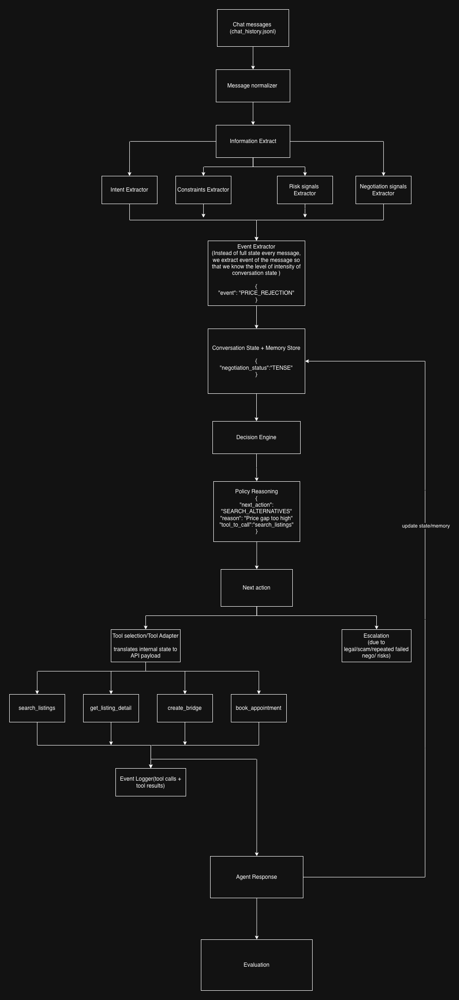

# Build an AI Agent for Vubike

## Overview

### Problem Statement

Motorbike marketplaces already solve browsing and listing discovery reasonably well.

However, real users still struggle with:

- deciding which bike fits their actual needs
- comparing multiple listings efficiently
- negotiating with sellers
- coordinating inspections
- evaluating trust and paperwork risks
- managing fragmented conversations across days/weeks

Traditional marketplaces assume users:

- know exactly what they want
- can evaluate listings rationally
- can detect scams or negotiation friction themselves

In practice, the buying journey is often uncertain, fragmented, and trust-sensitive.

The goal of this system is therefore not simply:

```text
search → click listing
```

but instead:

```text
understand → guide → coordinate → de-risk → convert
```

---

## Product Philosophy

This AI system is designed as:

```text
transaction orchestration + decision support
```

rather than:

```text
a general-purpose chatbot
```

The agent focuses on:

- workflow progression
- negotiation support
- trust/risk detection
- continuity across shopping journeys
- reducing transaction friction

---

## User Behavior Assumptions

For motorbike marketplaces, conversations are usually:

- short
- task-oriented
- episodic

Typical examples:

```text
“Show me Honda Winner X under 35M”
“Is this bike still available?”
“Can I negotiate?”
“Compare these two listings”
“Where can I inspect it?”
```

Most users do not maintain long emotional conversational threads.

However, continuity still matters because users often return during a buying journey.

Example:

| Day | User Behavior |
|---|---|
| Day 1 | Browse scooters |
| Day 3 | Ask about financing |
| Day 5 | Revisit shortlisted listings |
| Day 8 | Compare seller trustworthiness |

This means the system benefits more from:

- lightweight continuity
- operational memory
- preference persistence

rather than:

```text
infinite conversational memory
```

---

# Dataset

## Input File

```text
chat_history.jsonl
```

Each message contains:

```json
{
  "conversation_id": "c1",
  "timestamp": "2026-02-05T09:00:10Z",
  "sender": "buyer",
  "text": "Chào bạn, mình tìm xe tay ga tầm 25tr ở HCM"
}
```

---

## Fields

| Field | Description |
|---|---|
| conversation_id | unique conversation |
| timestamp | message timestamp |
| sender | buyer / seller / agent |
| text | raw unstructured message |

---

## Example Conversation Patterns

### c1 — Negotiation Friction

Buyer budget:

```text
25–26M
```

Seller expectation:

```text
32M
```

Detected signals:

- price mismatch
- negotiation tension
- seller unwilling to reduce price

---

### c2 — Document Risk

Seller states:

```text
“chưa sang tên được ngay”
```

Detected signals:

- paperwork uncertainty
- ownership transfer delay
- trust/safety escalation candidate

---

### c3 — Seller Rejects Intermediary

Seller states:

```text
“không muốn qua trung gian”
```

Detected signals:

- seller resistance to platform coordination
- bridge creation friction
- reduced orchestration capability

---

# High-Level Architecture

```text
User Message
    ↓
Extraction Layer
    ↓
Operational State Update
    ↓
Policy Reasoning Engine
    ↓
Tool Orchestration
    ↓
Tool Execution
    ↓
State Transition
    ↓
Logging + Evaluation
    ↓
Agent Response
```

---

# Core Design Philosophy

The system separates memory into multiple layers.

| Layer | Purpose |
|---|---|
| Raw Logs | Source of truth stored for replayability, debugging, auditing, retraining |
| Structured Memory | Reusable operational facts for retrieval and reasoning |
| Rolling Summary | Compressed workflow memory for efficient LLM context |

---

# Why This Design?

The system intentionally avoids:

```text
“store everything forever in prompt context”
```

because marketplace conversations are:

- repetitive
- localized
- operationally focused

Instead, we optimize for:

- compact workflow memory
- continuity across shopping journeys
- efficient reasoning
- observability
- replayability

---

# Memory Strategy

## What Should Be Stored?

### Structured Operational Memory

Useful reusable facts:

- preferred brands
- budget range
- city/location
- shortlisted bikes
- negotiation stage
- financing preference
- trust/risk signals

---

## What Should Stay Only In Logs?

Low-value long-term data:

- small talk
- repeated confirmations
- verbose negotiation back-and-forth
- temporary conversational noise

Logs remain useful for:

- replayability
- debugging
- analytics
- offline evaluation

---

# Memory Retrieval Strategy

The system does not retrieve all historical logs into the LLM context.

Instead it retrieves:

- operational state
- rolling summaries
- recent relevant messages
- critical risk signals

This acts as:

```text
compact workflow memory retrieval
```

rather than:

```text
full historical replay
```

---

# Memory Compaction Strategy

## HOT MEMORY

Recent active messages.

Examples:

- latest negotiation
- newest buyer constraint
- recent seller response

---

## WARM MEMORY

Session-level summaries and operational state.

Examples:

- shortlisted bikes
- current negotiation stage
- unresolved risks

---

## COLD MEMORY

Long-term persistence:

- embeddings
- analytics
- user profile
- archived logs

---

# Compression Techniques

## Sliding Window

Keep recent messages active while summarizing older content.

---

## Hierarchical Summarization

Instead of one giant summary:

```text
daily summaries
→ weekly summaries
→ long-term profile
```

---

## Semantic Deduplication

Repeated facts reinforce confidence rather than duplicating memory.

Example:

```json
{
  "preferred_brand": {
    "value": "Honda",
    "confidence": 0.93,
    "mention_count": 7
  }
}
```

---

## Time Decay

Some memory naturally expires over time.

Example:

```text
importance *= exp(-lambda * age)
```

---

# Infrastructure Architecture

| Component | Purpose |
|---|---|
| Redis | active session state |
| PostgreSQL | conversations, profiles, listings |
| Kafka | event streaming |
| S3 | raw logs + tool traces |
| Vector DB | embeddings + semantic retrieval |

---

# State Schema

## State Design Philosophy

The schema is designed as:

```text
transaction orchestration + decision support state
```

rather than:

```text
listing search memory
```

The operational state emphasizes:

- buyer ambiguity
- negotiation dynamics
- trust/risk
- workflow progression
- coordination friction
- agent reasoning

We only store fields that are:

- operationally useful
- expensive/unreliable to recompute
- important for future decisions

This keeps the system compact while preserving workflow continuity.

---

# Operational State Schema

```json
{
  "conversation_id": "c1",

  "participants": {
    "buyer_id": "buyer_123",
    "seller_id": "seller_789"
  },

  "lead_stage": {
    "status": "NEGOTIATION",
    "deal_closure_likelihood": "MEDIUM",
    "buyer_interest_level": "HIGH",
    "seller_engagement_level": "MEDIUM",
    "last_progress_at": "2026-02-05T09:03:00Z"
  },

  "buyer_profile": {
    "use_case": "daily commuting",

    "decision_confidence": "MEDIUM",

    "preferences": {
      "vehicle_type": "scooter",
      "budget_min": 25000000,
      "budget_max": 26000000,
      "preferred_brands": ["Honda", "Yamaha"],
      "preferred_year_min": 2020,
      "max_odo_km": 20000,
      "location": "HCM"
    },

    "latent_needs": [
      "fuel efficiency",
      "reliable resale value"
    ],

    "deal_breakers": [
      "paperwork issues",
      "high odo"
    ]
  },

  "marketplace_state": {
    "candidate_listings": [
      {
        "listing_id": "listing_ab_2021",
        "seller_id": "seller_789",

        "status": "NEGOTIATING",

        "risk_flags": [
          "PRICE_GAP"
        ],

        "interaction_flags": [
          "seller reluctant to negotiate"
        ],

        "active_channel_id": "channel_123"
      }
    ],

    "selected_listing_id": "listing_ab_2021",

    "recommended_listing_ids": [
      "listing_vision_2022",
      "listing_lead_2021"
    ]
  },

  "trust_and_safety": {
    "global_risk_flags": [],

    "escalation_status": {
      "is_escalated": false,
      "reason": null
    }
  },

  "agent_reasoning": {
    "open_questions": [
      "Can seller reduce price?"
    ],

    "missing_information": [
      "maintenance history"
    ],

    "next_best_action": {
      "action": "NEGOTIATE_PRICE",
      "reason": "Strong buyer interest but unresolved price gap"
    }
  },

  "conversation_summary": {
    "rolling_summary":
      "Buyer seeks scooter under 26m in HCM. Seller offers Air Blade 2021 at 32m. Negotiation tension remains unresolved."
  },

  "outcome_status": {
    "appointment_booked": false,
    "bridge_created": true,
    "escalated": false
  },

  "updated_at": "2026-02-05T09:05:00Z"
}
```

---

# Why Tool History Is Not Stored In State

Tool calls accumulate indefinitely.

Storing them directly inside operational state would make memory:

- noisy
- expensive
- operationally inefficient

Instead:

- operational state stays compact
- tool calls are persisted in logs

This separation improves:

- replayability
- observability
- evaluation
- debugging

without polluting workflow memory.

---

# State Design Benefits

| Capability | Explanation |
|---|---|
| Multi-listing support | Buyers can explore multiple bikes/sellers simultaneously |
| Compact state | Only operationally important memory is stored |
| Tool compatibility | Lightweight mapping into APIs |
| Future orchestration | Supports future workflows without redesign |
| Evaluation support | Structured state enables offline metrics |
| Replayability | Logs preserve execution history separately |

---

# Tool Architecture Philosophy

We intentionally avoid forcing internal state to mirror APIs exactly.

Instead, the system separates:

| Layer | Responsibility |
|---|---|
| State | business/workflow memory |
| Policy Layer | decision logic |
| Tool Adapter | state → API translation |
| Tools | execution |

This decoupling improves:

- flexibility
- maintainability
- future extensibility

---

# Tool Orchestration Flow

```text
Message
→ Extraction
→ State Update
→ Policy Reasoning
→ Tool Decision
→ Tool Execution
→ State Transition
→ Logging
```

---

# Internal Tools

## search_listings(query)

### Purpose

Retrieve candidate listings matching buyer constraints.

### Input

```json
{
  "brand": ["Honda"],
  "price_range": {
    "max": 26000000
  },
  "location": "HCM"
}
```

---

## get_listing_detail(listing_id)

### Purpose

Retrieve detailed listing information.

### Used For

- risk evaluation
- negotiation support
- paperwork verification

---

## create_chat_bridge(buyer_id, seller_id, listing_id)

### Purpose

Create trusted buyer ↔ seller communication channel.

---

## book_appointment(channel_id, time, place)

### Purpose

Coordinate physical inspection/test ride.

---

## log_event(conversation_id, event)

### Purpose

Persist workflow traces and execution history.

---

# Unstructured Data Handling

## Message Normalization

### Raw Input

```json
{
  "sender":"buyer",
  "text":"Honda hoặc Yamaha, đời 2020 trở lên"
}
```

---

### Normalized Output

```json
{
  "role":"buyer",
  "intent":"DEFINE_CONSTRAINT",
  "entities":{
    "brand":["Honda","Yamaha"],
    "min_year":2020
  }
}
```

---

# Intent Detection Strategy

## Rule-Based Extraction

Useful for:

- deterministic workflows
- high precision
- low latency
- explainability

Examples:

- “show”
- “compare”
- “book”
- “search”

---

## ML/LLM Extraction

Useful for:

- ambiguous language
- flexible interpretation
- semantic understanding

Recommended approach:

```text
rules first
→ ML/LLM fallback
```

to balance:

- cost
- speed
- reliability

---

# Risk Detection Strategy

The system combines:

- rule-based safety checks
- lightweight anomaly scoring
- semantic extraction

Examples:

| Signal | Risk |
|---|---|
| deposit before inspection | FRAUD_RISK |
| external Telegram redirect | OFF_PLATFORM_RISK |
| VIN mismatch | IDENTITY_RISK |
| extremely low price | SCAM_RISK |

Rules are preferred for safety because they are:

- deterministic
- explainable
- auditable
- enforceable

---

# Escalation Strategy

The system balances:

```text
under-escalation
```

vs

```text
over-escalation
```

because:

- under-escalation is dangerous
- over-escalation is expensive

---

## Escalation Triggers

- legal/document issues
- fraud suspicion
- policy violations
- low-confidence reasoning
- emotionally sensitive interactions

---

## Escalation Goals

- protect users
- protect marketplace trust
- prevent unsafe automation
- maintain conversion quality

---

# Expected Agent Behaviors

| Situation | Expected Behavior |
|---|---|
| Missing constraints | Ask clarifying questions |
| Buyer intent sufficiently clear | Search listings |
| Mutual interest detected | Create buyer ↔ seller bridge |
| Buyer requests viewing | Book appointment |
| Severe risk detected | Escalate |

---

# Evaluation & Feedback Loop

## Primary Success Metric

Increase successful marketplace transactions.

---

## Hypothesis

Better:

- state tracking
- risk detection
- next-action selection

will improve:

- appointment booking
- qualified matches
- transaction completion

---

# Metrics

## Task Metrics

- match success rate
- appointment booking rate
- escalation accuracy
- next-action correctness

---

## Quality Metrics

- slot coverage
- hallucination rate
- policy violation rate

---

## Business Metrics

- seller response retention
- time to qualified match
- drop-off after contact

---

# Limitations

The current architecture intentionally favors:

- operational simplicity
- modularity
- observability

over:

```text
maximal intelligence
```

Current limitations include:

- limited long-term personalization
- extraction/inference noise
- stale marketplace state
- simplistic multi-listing ranking
- increased infrastructure complexity

---

# Future Improvements

Potential future directions:

- negotiation ranking models
- trust scoring systems
- personalized recommendation memory
- real-time listing synchronization
- reinforcement-learning feedback loops
- seller reliability prediction
- automated follow-up orchestration

---

# Tech Stack

| Layer | Technology |
|---|---|
| Backend | Python / FastAPI |
| LLM orchestration | LangGraph / custom orchestration |
| Structured storage | PostgreSQL |
| Session memory | Redis |
| Streaming events | Kafka |
| Embeddings | Vector DB |
| Raw logs | S3 |
| Frontend | React |